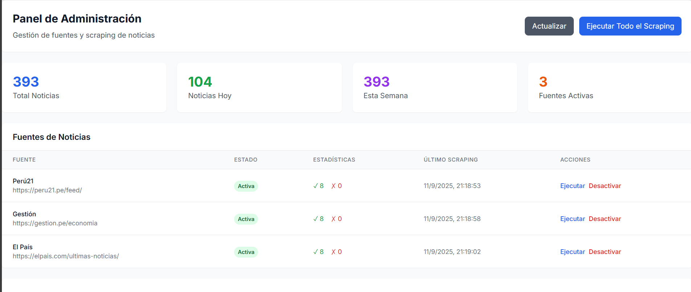
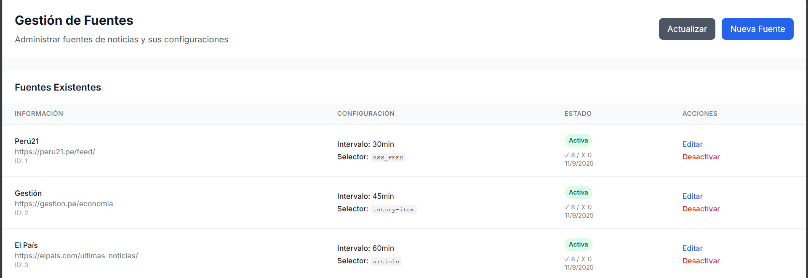

# Portal de Noticias

Una aplicación web completa para la agregación automática de noticias de múltiples fuentes con interfaz administrativa y capacidades de web scraping.

## 🚀 Características Principales

- **Web Scraping Inteligente**: Extrae noticias automáticamente de sitios web y feeds RSS
- **Dashboard Administrativo**: Panel completo para gestionar fuentes y monitorear el sistema
- **Búsqueda Avanzada**: Filtros por fuente, categoría, fecha y palabras clave
- **Interfaz Responsiva**: Diseño optimizado para desktop y móvil
- **Diversidad de Fuentes**: Algoritmo que balancea noticias de diferentes fuentes
- **Gestión de Fuentes**: CRUD completo con testing de configuraciones

## 🏗️ Arquitectura

### Backend
- **Spring Boot 3.x** con Java 17
- **PostgreSQL** como base de datos
- **JSoup** para scraping HTML
- **Rome** para feeds RSS
- **REST APIs** completas
- **Scheduling** automático

### Frontend
- **React 18** con hooks modernos
- **Tailwind CSS** para estilos
- **Componentes modulares**
- **SPA** (Single Page Application)

## 📋 Requisitos

### Desarrollo
- Java 17+
- Node.js 16+
- PostgreSQL 12+
- Maven 3.6+
- npm/yarn

### Producción
- 4GB RAM mínimo
- 50GB almacenamiento
- CPU 2 vCores
- Ubuntu 20.04+ / CentOS 8+

## 🔧 Instalación Rápida

### 1. Clonar Repositorio
```bash
git clone https://github.com/tu-usuario/portal-noticias.git
cd portal-noticias
```

### 2. Configurar Base de Datos
```sql
-- PostgreSQL
CREATE DATABASE news_portal_db;
CREATE USER news_user WITH PASSWORD 'tu_password';
GRANT ALL PRIVILEGES ON DATABASE news_portal_db TO news_user;
```

### 3. Backend
```bash
cd backend
# Editar application.properties con tus credenciales de BD
mvn clean install
mvn spring-boot:run
```

### 4. Frontend
```bash
cd frontend
npm install
npm start
```

### 5. Acceder a la Aplicación
- **Frontend**: http://localhost:3000
- **Backend API**: http://localhost:8090/api
- **Admin Panel**: http://localhost:3000 → Gestionar Fuentes

## 📖 Documentación

- **[Manual de Instalación](docs/installation-manual.md)** - Guía completa de instalación
- **[Manual de Usuario](docs/user-manual.md)** - Cómo usar la aplicación  
- **[Manual de Despliegue](docs/deployment-manual.md)** - Deploy en producción
- **[Manual General](docs/general-manual.md)** - Arquitectura y desarrollo

## 🎯 Uso Básico

### Configurar Fuente RSS
1. Ir a "Gestionar Fuentes"
2. Clic en "Nueva Fuente"
3. Usar plantilla "RSS Feed"
4. Configurar:
   ```
   Nombre: Perú21
   URL: https://peru21.pe/feed/
   Selector: RSS_FEED
   ```
5. "Probar Configuración" → "Crear Fuente"

### Configurar Fuente HTML
```
Nombre: El Comercio
URL: https://elcomercio.pe/noticias
Selector Lista: article.story
Selector Título: h2 a
Selector Resumen: .story-summary
```

### Ejecutar Scraping
1. Dashboard Admin → "Ejecutar Todo el Scraping"
2. Ver resultados en tiempo real
3. Las noticias aparecen automáticamente en el portal

## 🛠️ API Endpoints

### Noticias
```http
GET /api/news                    # Todas las noticias
GET /api/news/popular           # Más populares
GET /api/news/recent            # Últimas 24h
GET /api/news/source/{id}       # Por fuente
GET /api/news/category/{cat}    # Por categoría
GET /api/news/search?keyword=   # Búsqueda
```

### Administración
```http
POST /api/scraping/run-all      # Ejecutar scraping
POST /api/scraping/sources      # Crear fuente
PUT /api/scraping/sources/{id}  # Actualizar fuente
GET /api/scraping/status        # Estado del sistema
```

## 🔍 Ejemplos de Configuración

### Fuentes RSS Populares
```json
{
  "Gestión": "https://gestion.pe/feed/",
  "El País": "https://elpais.com/rss/elpais/portada.xml",
  "BBC Mundo": "https://www.bbc.com/mundo/rss.xml"
}
```

### Selectores HTML Comunes
```css
/* Títulos */
"h1", "h2 a", ".title", ".headline"

/* Resúmenes */  
".summary", ".excerpt", ".lead", ".description"

/* Imágenes */
"img", ".image img", ".thumbnail img", "figure img"

/* Fechas */
".date", "time", ".published", ".timestamp"
```

## 🎨 Screenshots

### Portal Principal


### Dashboard Admin


### Gestión de Fuentes


## 🚧 Desarrollo

### Estructura del Proyecto
```
portal-noticias/
├── backend/                 # Spring Boot API
│   ├── src/main/java/
│   │   └── com/webscrap/portalnoticias/
│   │       ├── controller/  # REST Controllers
│   │       ├── service/     # Business Logic
│   │       ├── repository/  # Data Access
│   │       ├── entity/      # JPA Entities
│   │       └── dto/         # Data Transfer Objects
│   └── src/main/resources/
├── frontend/                # React App
│   ├── src/
│   │   ├── components/      # React Components
│   │   ├── services/        # API Calls
│   │   └── utils/           # Utilities
│   └── public/
└── docs/                    # Documentation
```

### Tecnologías Utilizadas

#### Backend
- Spring Boot Web
- Spring Data JPA
- PostgreSQL Driver
- JSoup (HTML parsing)
- Rome (RSS parsing)
- Lombok
- Spring Boot Scheduler

#### Frontend
- React + React DOM
- Tailwind CSS
- Modern JavaScript (ES6+)
- Fetch API
- React Hooks

## 🔒 Seguridad

- Validación de entrada en todas las APIs
- Sanitización de datos de scraping
- CORS configurado apropiadamente
- Rate limiting para APIs
- Backup automático de datos

## 📊 Rendimiento

- **Base de Datos**: Índices optimizados para consultas frecuentes
- **Backend**: Pool de conexiones, cache, compresión GZIP
- **Frontend**: Lazy loading, componentes optimizados, bundle splitting
- **Scraping**: Rate limiting respetuoso, reintentos automáticos

## 🚀 Despliegue

### Docker
```bash
docker-compose build
docker-compose up -d
```

### VPS/Cloud
Ver [Manual de Despliegue](docs/deployment-manual.md) para instrucciones detalladas de:
- Servidor Ubuntu/CentOS
- Nginx + SSL
- PostgreSQL optimizado
- Systemd services

## 🤝 Contribuir

1. Fork el proyecto
2. Crear feature branch (`git checkout -b feature/nueva-funcionalidad`)
3. Commit cambios (`git commit -m 'Agregar nueva funcionalidad'`)
4. Push al branch (`git push origin feature/nueva-funcionalidad`)
5. Crear Pull Request

### Guidelines
- Seguir convenciones de Java (backend) y JavaScript (frontend)
- Agregar tests para nuevas funcionalidades
- Actualizar documentación según sea necesario
- Usar mensajes de commit descriptivos

## 🐛 Solución de Problemas

### Backend no inicia
```bash
# Verificar Java
java -version

# Verificar PostgreSQL
psql -U postgres -c "SELECT 1"

# Ver logs
tail -f logs/news-portal.log
```

### Frontend no carga
```bash
# Limpiar cache
npm start -- --reset-cache

# Reinstalar dependencias
rm -rf node_modules package-lock.json
npm install
```

### Scraping falla
1. Verificar conectividad a la fuente
2. Revisar selectores CSS en la configuración
3. Usar función de debug en "Gestionar Fuentes"
4. Comprobar que la fuente no haya cambiado estructura

## 📈 Roadmap

### v2.1 (Próximamente)
- [ ] Sistema de notificaciones
- [ ] API pública documentada
- [ ] Filtros avanzados por fecha
- [ ] Exportación de datos (CSV, JSON)

### v2.2
- [ ] Análisis de sentimientos
- [ ] Detección automática de duplicados
- [ ] Sistema de trending topics
- [ ] Mobile app (React Native)

### v3.0
- [ ] Machine Learning para categorización
- [ ] Arquitectura de microservicios
- [ ] Notificaciones en tiempo real
- [ ] Dashboard de analytics avanzado

## 📝 Licencia

Este proyecto está bajo la Licencia MIT - ver el archivo [LICENSE](LICENSE) para más detalles.

## 👥 Equipo

- **Desarrollador Principal**: [Tu Nombre](mailto:tu-email@ejemplo.com)
- **Contribuidores**: Ver [CONTRIBUTORS.md](CONTRIBUTORS.md)

## 📞 Soporte

- **Issues**: [GitHub Issues](https://github.com/tu-usuario/portal-noticias/issues)
- **Documentación**: [Wiki del proyecto](https://github.com/tu-usuario/portal-noticias/wiki)
- **Email**: soporte@portal-noticias.com

## 🎉 Agradecimientos

- Spring Boot community por el framework robusto
- React team por la excelente biblioteca UI
- JSoup y Rome maintainers por las librerías de parsing
- Tailwind CSS por el sistema de diseño
- PostgreSQL team por la base de datos confiable

---

**¿Te gusta el proyecto?** ⭐ Dale una estrella en GitHub y compártelo con otros desarrolladores.